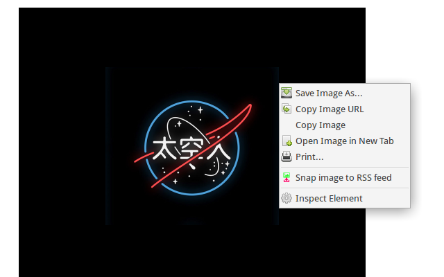

[Click here to install from Chrome web store](https://chrome.google.com/webstore/detail/pmleogpeepphbpbebpldklnkejieooda/).

Chrome Extension for the right-click menu - download an image and add it to an RSS feed.

 * Destination folder is configurable.
 * An RSS feed of images snapped is created in the destination folder.
 * You can optionally install a simple index.html feed viewer into the destination folder.
 * Upload the destination folder to a server to make it web accessible.

GPLv3 licensed. Copyright Chris McCormick, 2014.
